# PULLEY - Automated Trading with AI Integration

A decentralized trading protocol with AI-powered external trading, automated fund management, and PULLEY insurance token built on Aptos.

## 🎯 Overview

PULLEY is a next-generation DeFi protocol that combines:
- **Trading Pool**: Users deposit funds for automated AI trading
- **AI Trading Bot**: External trading via Merkle with automated profit/loss reporting
- **PULLEY Insurance Token**: Floating stablecoin (PUL) that absorbs trading losses
- **Blocklock Automation**: Fully automated operations except deposits/withdrawals
- **Nodit Integration**: Real-time trade indexing and profit/loss tracking

## 🏗️ System Architecture

### Core Components

1. **Trading Pool** (`trading_pool.move`)
   - User deposits and withdrawals with pool tokens
   - Threshold-based automated fund transfers
   - Proportional profit distribution to users
   - Blocklock automation triggers

2. **Controller** (`controller.move`)
   - 15% insurance allocation (mints PULLEY tokens)
   - 85% to AI trading bot wallet
   - 10% insurance / 90% trader profit distribution
   - Automated loss absorption via insurance

3. **Insurance Token** (`insurance_token.move`)
   - PULLEY (PUL) fungible asset with dual minting system
   - External minting (anyone) + Trading insurance minting (controller)
   - Floating stablecoin with market-driven pricing
   - Automatic loss absorption through token burning

## 📊 System Flow Diagram

```mermaid
graph TB
    %% User Interactions
    Users[👥 Users] --> |Deposit Funds| TradingPool[🏦 Trading Pool]
    External[🌐 External Users] --> |Mint PULLEY| InsuranceToken[🛡️ Insurance Token<br/>PULLEY/PUL]
    
    %% Core Contract Flow
    TradingPool --> |Threshold Met<br/>Auto Transfer| Controller[⚙️ Controller]
    Controller --> |15% Insurance| InsuranceToken
    Controller --> |85% Trading| TradingAddress[🤖 AI Trading Bot<br/>Wallet Address]
    
    %% Trading Bot Operations
    TradingAddress --> |Execute Trades| MerkleTrading[📈 Merkle Trading<br/>External DEX]
    MerkleTrading --> |Trade Results| NoditAPI[📊 Nodit API<br/>Query & Index]
    NoditAPI --> |Profit/Loss Data| Controller
    
    %% Profit/Loss Distribution
    Controller --> |10% Insurance<br/>Mint PULLEY| InsuranceToken
    Controller --> |90% Traders<br/>Distribute| TradingPool
    Controller --> |Loss Absorption<br/>Burn PULLEY| InsuranceToken
    
    %% Blocklock Automation
    BlocklockBot[🔄 Blocklock Bot] --> |Monitor Threshold| TradingPool
    BlocklockBot --> |Trigger Transfers| Controller
    BlocklockBot --> |Query Trade Results| NoditAPI
    BlocklockBot --> |Report P&L| Controller
    
    %% User Withdrawals
    TradingPool --> |Withdraw Funds| Users
    
    %% Styling
    classDef userClass fill:#e1f5fe,stroke:#01579b,stroke-width:2px
    classDef contractClass fill:#f3e5f5,stroke:#4a148c,stroke-width:2px
    classDef botClass fill:#e8f5e8,stroke:#1b5e20,stroke-width:2px
    classDef externalClass fill:#fff3e0,stroke:#e65100,stroke-width:2px
    
    class Users,External userClass
    class TradingPool,Controller,InsuranceToken contractClass
    class TradingAddress,BlocklockBot botClass
    class MerkleTrading,NoditAPI externalClass
```



## 🪙 PULLEY Token Economics

```mermaid
graph LR
    subgraph "PULLEY Token Economics"
        A[External Mint<br/>Anyone can mint] --> |Increases| ExternalSupply[External Supply<br/>Market Driven]
        B[Trading Insurance Mint<br/>Controller only] --> |Increases| InsuranceSupply[Insurance Supply<br/>Trading Backed]
        
        ExternalSupply --> |Combined| TotalSupply[Total PULLEY Supply]
        InsuranceSupply --> |Combined| TotalSupply
        
        TotalSupply --> |Price Impact| FloatingPrice[Floating Price<br/>Based on:<br/>• Market Utilization<br/>• Trading Volume<br/>• Supply Dynamics]
    end
    
    subgraph "Loss Absorption Mechanism"
        TradingLoss[Trading Loss] --> |Burns Tokens| InsuranceSupply
        InsuranceSupply --> |Reduces| TotalSupply
        TotalSupply --> |Price Recovery| FloatingPrice
    end
    
    subgraph "Profit Distribution"
        TradingProfit[Trading Profit] --> |10%| ProfitToInsurance[Mint New PULLEY<br/>to Insurance]
        TradingProfit --> |90%| ProfitToTraders[Distribute to<br/>Pool Participants]
        ProfitToInsurance --> |Increases| InsuranceSupply
    end
    
    classDef supplyClass fill:#e3f2fd,stroke:#0277bd,stroke-width:2px
    classDef mechanismClass fill:#f1f8e9,stroke:#388e3c,stroke-width:2px
    classDef priceClass fill:#fce4ec,stroke:#c2185b,stroke-width:2px
    
    class ExternalSupply,InsuranceSupply,TotalSupply supplyClass
    class TradingLoss,TradingProfit,ProfitToInsurance,ProfitToTraders mechanismClass
    class FloatingPrice priceClass
```



## 🔄 Automated Operation Sequence

```mermaid
sequenceDiagram
    participant U as Users
    participant TP as Trading Pool
    participant C as Controller
    participant IT as Insurance Token
    participant TB as AI Trading Bot
    participant MT as Merkle Trading
    participant N as Nodit API
    participant BL as Blocklock Bot
    
    %% Initial Setup
    Note over U,BL: System Initialization
    U->>TP: Deposit Funds
    TP->>TP: Accumulate until threshold
    
    %% Automated Fund Transfer
    BL->>TP: Monitor threshold
    TP-->>BL: Threshold met signal
    BL->>TP: Trigger transfer_to_controller()
    TP->>C: Transfer funds to controller
    
    %% Fund Allocation
    BL->>C: Trigger allocate_funds()
    C->>IT: 15% → Mint PULLEY insurance tokens
    C->>TB: 85% → Send to trading bot wallet
    
    %% Trading Operations
    TB->>MT: Execute trades on Merkle
    MT-->>N: Trade data indexed
    
    %% Profit Scenario
    alt Trading Profit
        BL->>N: Query profit data
        N-->>BL: Return profit amount
        BL->>C: Report profit
        C->>IT: 10% → Mint additional PULLEY
        C->>TP: 90% → Send to trading pool
        TP->>U: Distribute to users (via pool tokens)
    
    %% Loss Scenario
    else Trading Loss
        BL->>N: Query loss data
        N-->>BL: Return loss amount
        BL->>C: Report loss
        C->>IT: Absorb loss → Burn PULLEY tokens
        Note over IT: Insurance supply decreases
    end
    
    %% User Withdrawals
    U->>TP: Request withdrawal
    TP->>U: Return proportional share
    
    Note over U,BL: Fully Automated Except User Actions
```



## 🚀 Key Features

### 🤖 AI-Powered Trading
- **External Trading Bot**: AI-powered trading on Merkle DEX
- **Automated Execution**: No manual intervention required
- **Real-time Monitoring**: Continuous profit/loss tracking via Nodit

### 🛡️ PULLEY Insurance System
- **Floating Stablecoin**: Market-driven price discovery
- **Dual Supply Tracking**: External + trading insurance supplies
- **Automatic Loss Absorption**: Burns tokens to cover losses
- **Profit Distribution**: Mints new tokens from profits

### ⚡ Full Automation
- **Blocklock Integration**: Automated operations except user deposits/withdrawals
- **Threshold Monitoring**: Automatic fund transfers when limits reached
- **P&L Reporting**: Automated profit/loss distribution
- **Event-Driven**: Comprehensive monitoring and triggering system

### 🔒 Trust-Minimized Design
- **Controlled Trading Address**: Admin-controlled but automated fund flows
- **Transparent Operations**: All transactions on-chain
- **Predictable Allocations**: Fixed 15%/85% split, 10%/90% profit distribution

## 📋 Smart Contract Details

### Trading Pool Contract
```move
// Core functions for user interaction
public fun deposit<CoinType>() // Users deposit funds
public fun withdraw<CoinType>() // Users withdraw proportional share
public fun is_threshold_met<CoinType>() // Blocklock monitoring
public fun transfer_to_controller<CoinType>() // Automated trigger
```

### Controller Contract
```move
// Fund allocation and management
public fun allocate_funds<CoinType>() // 15%/85% split
public fun report_profit<CoinType>() // 10%/90% distribution
public fun report_loss<CoinType>() // Insurance absorption
public fun has_funds_to_allocate<CoinType>() // Automation helper
```

### Insurance Token Contract
```move
// PULLEY token management
public entry fun mint_external() // Anyone can mint
public fun mint_insurance() // Controller only
public fun absorb_loss() // Burn tokens for losses
public fun deposit_profit() // Mint tokens from profits
```

## 🛠️ Development & Testing

### Prerequisites
- Aptos CLI v2.0+
- Move compiler
- Node.js (for integration testing)

### Building
```bash
aptos move compile --named-addresses pulley=<your_address>
```

### Testing
```bash
# Run all tests
aptos move test

# Run specific test module
aptos move test --filter insurance_token_tests
aptos move test --filter controller_tests  
aptos move test --filter trading_pool_tests
```

### Test Coverage
- ✅ **Insurance Token Tests**: Minting, burning, authorization, profit/loss handling
- ✅ **Controller Tests**: Fund allocation, profit distribution, loss absorption
- ✅ **Trading Pool Tests**: Deposits, withdrawals, threshold management, automation

## 🚀 Deployment Guide

### 1. Contract Deployment
```bash
# Deploy contracts with proper addresses
aptos move publish --named-addresses pulley=<admin_address>
```

### 2. System Configuration
```move
// Initialize insurance token (automatic via init_module)
// Initialize controller
controller::initialize<CoinType>(
    admin,
    trading_pool_address,
    insurance_admin_address, 
    ai_trading_bot_address
);

// Initialize trading pool
trading_pool::initialize<CoinType>(
    admin,
    threshold_amount,
    controller_address
);

// Authorize controller in insurance system
insurance_token::authorize_controller(admin, controller_address);
```

### 3. Blocklock Automation Setup
- Configure threshold monitoring on trading pool
- Set up profit/loss querying from Nodit API
- Implement automated reporting to controller
- Enable fund allocation triggers

### 4. AI Trading Bot Configuration
- Configure bot wallet address in controller
- Set up Merkle trading integration
- Enable profit/loss reporting via Nodit
- Configure trading strategies and risk parameters

## 📊 Integration Points

### Nodit API Integration
```javascript
// Query trade results
const tradeResults = await nodit.query({
  address: tradingBotAddress,
  timeframe: '1h',
  protocols: ['merkle']
});

// Report to controller
if (tradeResults.profit > 0) {
  await controller.report_profit(tradeResults.profit);
} else if (tradeResults.loss > 0) {
  await controller.report_loss(tradeResults.loss);
}
```

### Blocklock Automation
```javascript
// Monitor threshold
const thresholdMet = await tradingPool.is_threshold_met();
if (thresholdMet) {
  await tradingPool.transfer_to_controller();
}

// Monitor controller funds
const hasFunds = await controller.has_funds_to_allocate();
if (hasFunds) {
  await controller.allocate_available_funds();
}
```

## 📈 Economic Model

### Fund Allocation
- **15% Insurance**: Mints PULLEY tokens for risk coverage
- **85% Trading**: Sent to AI trading bot for external trading

### Profit Distribution
- **10% Insurance**: Mints additional PULLEY tokens
- **90% Traders**: Distributed proportionally to pool participants

### Loss Absorption
- **Primary**: Insurance burns PULLEY tokens to cover losses
- **Secondary**: If insurance insufficient, proportional loss sharing

### PULLEY Token Price Factors
- Market utilization rate
- External minting demand
- Trading volume and success
- Insurance coverage adequacy

## 🔐 Security Considerations

### Smart Contract Security
- Comprehensive test coverage (>95%)
- Access control on critical functions
- Reentrancy protection
- Integer overflow/underflow protection

### Economic Security
- Insurance fund adequacy monitoring
- Maximum loss limits per trading period
- Emergency pause functionality
- Admin multi-signature requirements

### Operational Security
- Secure AI trading bot wallet management
- API key rotation for Nodit integration
- Blocklock automation monitoring
- Regular system health checks

## 🛣️ Roadmap

### Phase 1: Core Implementation ✅
- PULLEY insurance token (FA standard)
- Controller with 15%/85% allocation
- Trading pool with automation hooks
- Comprehensive test suite

### Phase 2: Integration & Automation 🚧
- Blocklock automation implementation
- Nodit API integration for P&L tracking
- AI trading bot development
- Merkle trading integration

### Phase 3: Advanced Features 📋
- Multi-asset support
- Dynamic allocation strategies
- Advanced risk management
- Governance token integration

### Phase 4: Ecosystem Expansion 🔮
- Cross-chain compatibility
- Institutional features
- Additional trading protocols
- Advanced analytics dashboard

## 🤝 Contributing

We welcome contributions! Please see our [Contributing Guidelines](CONTRIBUTING.md).

### Development Process
1. Fork the repository
2. Create a feature branch
3. Implement changes with comprehensive tests
4. Submit a pull request with detailed description
5. Code review and integration testing

## 📄 License

This project is licensed under the MIT License - see the [LICENSE](LICENSE) file for details.

## 🆘 Support & Community

- **Documentation**: [docs.pulley.finance](https://docs.pulley.finance)
- **Discord**: [discord.gg/pulley](https://discord.gg/pulley)  
- **Twitter**: [@PulleyFinance](https://twitter.com/PulleyFinance)
- **GitHub**: [github.com/pulley-finance](https://github.com/pulley-finance)
- **Email**: support@pulley.finance

## ⚠️ Disclaimer

This software is experimental and involves significant financial risk. Users should:
- Understand the risks of automated trading systems
- Only invest funds they can afford to lose
- Conduct thorough due diligence
- Consider seeking professional financial advice

The protocol involves AI-powered trading, smart contract risks, and market volatility. Past performance does not guarantee future results.
